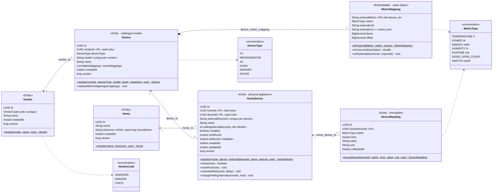

# Entity class diagram

JPA entities of `com.abhishek.smarthome.entity`. Relationships only map foreign keys (never navigated); related rows are loaded by id through repositories. `MetricMapping` is a value collection owned by `Device`.

